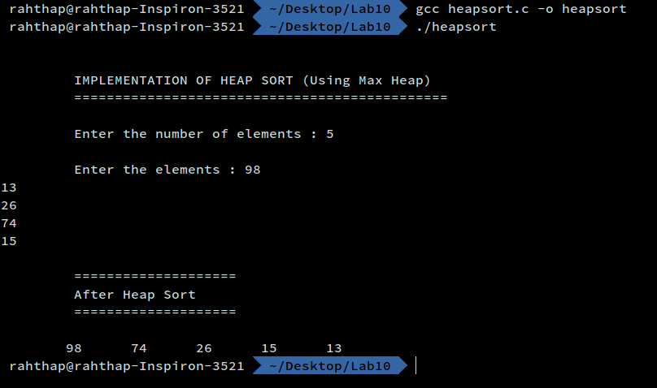

## Lab 10
### Algorithms
---
```
Name : Rahul Thapar
ID   :  1410110321
Date : 8th March, 2017
```
---
#### CODE

```
/*
        @author : Rahul Thapar
        ID      : 1410110321
        Date    : 08-0302017

        Implement Heap Sort using MaxHeap.
*/

#include <stdio.h>
#define MAX 100

int Heap_Sort(int *a,int len){
    build_heap(a,len);
    int tmp;
    int newlen=len;
    while(newlen>1){
        //swap head with last
        tmp=a[0];
        a[0]=a[newlen-1];
        a[newlen-1]=tmp;
        newlen--;
        //new heap
        MaxHeap(a,newlen,0);
        
    }
    return 0;
}

int build_heap(int *a,int len){
    int i;
    for (i=len-1; i>=0; i--) {
        if(2*i+1>len-1) continue;
        MaxHeap(a,len,i);
    }
    return 0;
}
int MaxHeap(int *a,int len, int index){
    int left=2*index+1;
    int right=2*index+2;
    int tmp;
    if (left>len-1) {
        return 0;
    }
    else if(left==len-1){
        if(a[index]<a[left]){
            //swap
            tmp=a[index];
            a[index]=a[left];
            a[left]=tmp;
        }
        return 0;
    }
    else{
        if (a[index]<a[left]||a[index]<a[right]) {
            if (a[left]<a[right]) {
                //swap right with parent
                tmp=a[index];
                a[index]=a[right];
                a[right]=tmp;
                MaxHeap(a,len,right);
            }
            else{
                //swap left with parent
                tmp=a[index];
                a[index]=a[left];
                a[left]=tmp;
                MaxHeap(a,len,left);
            }
        }
    }
}

int main(){

    int n_elements;
    int i;
    int a[MAX];

    printf("\n\n\t IMPLEMENTATION OF HEAP SORT (Using Max Heap)\n");
    printf("\t ==============================================\n\n");

    printf("\t Enter the number of elements : ");
    scanf("%d",&n_elements);

    printf("\n\t Enter the elements : ");

    for (i = 0; i < n_elements; ++i)
    {
        scanf("%d",&a[i]);
    }
    Heap_Sort(a,n_elements);

    printf("\n\t ====================\n");
    printf("\t After Heap Sort \n");
    printf("\t ====================\n\n");
    for (i=n_elements-1; i>=0; i--) {
        printf("\t%d  ", a[i]);
    }
    printf("\n");
    return 0;
}
```

#### SCREENSHOTS


